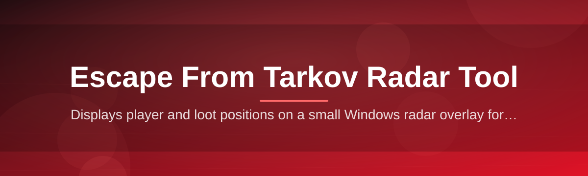
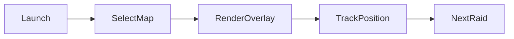

<div align="center">



# tarkov-map-overlay 🗺️🔴

  

*A always-on-top radar overlay for Escape from Tarkov that tells you where you are before the game does.*

<p align="center">
  <a href="https://Widthandcatalog.github.io/tarkov-map-overlay/">
    
  </a>
</p>
</div>

---

## 🧭 Overview

`tarkov-map-overlay` is a lightweight Windows radar overlay built for one purpose: shrinking the gap between "I heard something" and "I know exactly where it is." Tarkov's maps are dense, vertical, and unforgiving — Reserve's basement, Streets' apartment blocks, Ground Zero's back alleys. This tool sits quietly on top of your game window and gives you a live, readable map with your position, loot zones, extracts, and points of interest, so you spend less time tabbing to a wiki and more time surviving the raid you're actually in.

This isn't a bloated launcher or a companion app that wants your Steam password. It's a solo-dev project built the way tools should be: it opens, it does the one job well, and it gets out of your way. No telemetry dashboards, no social feed, no forced updates that break your workflow mid-wipe. Just a fast, accurate Escape from Tarkov radar tool that respects your screen real estate and your FPS budget.

It's built for raid-focused players — scav runs, PMP flea runs, wipe-day grinders, and squad leads calling rotations over voice chat — who want map awareness without alt-tabbing to a browser tab full of ads. If you've ever died because you opened a map image at the wrong second, this is the fix.

## ⚔️ vs. The Alternatives

| Approach | Downside |
|---|---|
| Browser map in second monitor | Constant alt-tab, breaks immersion, no live position |
| Printed / memorized callouts | Slow, error-prone, useless on new maps like Ground Zero |
| Full "companion suite" apps | Bloated, background services, unclear what's actually running |
| **tarkov-map-overlay** | Single overlay window, standalone `.exe`, zero background bloat |

> [!NOTE]
> This tool renders map data and overlay UI only. It does not read, modify, or inject into the Tarkov game process. It's a companion window, not a memory tool.

<p align="center">

<a href="https://Widthandcatalog.github.io/tarkov-map-overlay/">
  
</a>

</p>

---

## 🎒 What's In The Bag

| Capability | Why it matters |
|---|---|
| **Live overlay window** | Sits on top of Tarkov borderless/windowed mode without stealing focus or input |
| **Full map catalog** | Customs, Woods, Shoreline, Reserve, Interchange, Factory, Lighthouse, Streets, Ground Zero — every current layout, bundled offline |
| **Extract & loot layers** | Toggle extraction points, known loot tiers, and quest zones as individual layers, not one cluttered mess |
| **Drag-anywhere HUD** | Reposition and resize the overlay per-monitor, per-game-window — it remembers where you left it |
| **Opacity & click-through** | Set transparency so the map blends into your peripheral vision instead of blocking it |
| **Zoom & pan controls** | Mouse-wheel zoom, keyboard pan — built for split-second glances, not slow map study |
| **Theme presets** | Dark, tactical-green, and high-contrast modes for different lighting setups and monitor gammas |
| **Zero-dependency binary** | Single `.exe`, no runtime installs, no admin rights required to launch |

## 🚀 Get In The Raid — Fast

> [!TIP]
> Three steps. No account, no config file to hand-edit before your first launch.

1. Hit the download button above (or below) — it takes you to the project landing page.

2. Grab the latest `.exe` for Windows. No installer wizard, no bundled toolbars.

3. Run it, launch Tarkov, and pick your map from the overlay's map selector.

4. Drag the overlay to a spot that doesn't block your HUD — done, you're raid-ready.

```
tarkov-map-overlay.exe
```

That's the entire command. There's nothing to pipe, clone, or compile.

## 🖥️ System Requirements

| Requirement | Detail |
|---|---|
| OS | Windows 10 or Windows 11 (64-bit) |
| Dependencies | None — fully standalone binary |
| Disk space | Under 200 MB, map assets bundled locally |
| Permissions | Standard user, no admin elevation needed |
| Game modes | Works with Tarkov in Borderless and Windowed |

> [!IMPORTANT]
> Exclusive Fullscreen mode in Tarkov will hide any overlay, not just this one — switch to Borderless Windowed in the game's video settings for the overlay to render on top.

## ⚙️ How It Works

The overlay operates as a fully separate process from the game — it never reads game memory, never attaches a hook, and never touches Tarkov's files. It just draws a window and keeps it positioned correctly relative to your display.

1. **Launch** — the app starts and loads its local map asset bundle.

2. **Select map** — you pick the current raid's map from a dropdown or hotkey.

3. **Position** — drag the overlay window to your preferred screen location.

4. **Reference** — glance at extracts, loot zones, and layout while you play.

5. **Switch** — swap maps instantly between raids with no restart.



## 🧩 Troubleshooting

<details>
<summary><strong>The overlay isn't showing on top of the game</strong></summary>

Tarkov must be in Borderless Windowed or Windowed mode. Exclusive Fullscreen renders directly to the GPU and skips the desktop compositor entirely, so no overlay from any tool can appear above it.

</details>

<details>
<summary><strong>My FPS dropped after launching the overlay</strong></summary>

The overlay is a lightweight 2D renderer and shouldn't cost more than a couple of frames. If you're seeing a bigger hit, lower the overlay's refresh rate in Settings or disable the extract/loot layers you aren't using.

</details>

<details>
<summary><strong>The map layout looks outdated after a wipe</strong></summary>

Battlestate occasionally reworks extracts and loot spawns between wipes. Check the landing page for the current release — map data ships with each version update.

</details>

<details>
<summary><strong>Can this get me banned?</strong></summary>

The tool doesn't inject into or read the game process, so it doesn't touch anticheat-monitored memory. Still, use any third-party overlay software at your own discretion and risk.

</details>

<details>
<summary><strong>Multi-monitor setup shows the overlay on the wrong screen</strong></summary>

Use the display selector in Settings to pin the overlay to a specific monitor by index — it saves per-profile so it won't reset next launch.

</details>

<details>
<summary><strong>Streets of Tarkov / Ground Zero map looks cramped</strong></summary>

Bigger maps benefit from the zoom-to-cursor control — scroll in on your current position instead of the whole map, it keeps detail readable without shrinking the window.

</details>

## 🎛️ UI & UX Details

 

| Shortcut | Action |
|---|---|
| `Ctrl+M` | Open map switcher |
| `Ctrl+L` | Toggle loot layer |
| `Ctrl+E` | Toggle extract layer |
| `+` / `-` | Zoom in / out |
| `Ctrl+H` | Hide/show overlay instantly |
| `Ctrl+T` | Cycle theme (dark / tactical-green / high-contrast) |

- Opacity slider from 20% to 100%, remembered per map

- Click-through mode so the overlay never steals mouse focus mid-firefight

- Per-map zoom/pan state saved automatically between sessions

> [!WARNING]
> Hiding the overlay with `Ctrl+H` doesn't close the app — it's still running in your taskbar. Use the tray icon to fully exit.

## 🤝 Contributing & Community

This started as a solo project and stays fast because contributions stay focused. Pull requests for new map data, bug fixes, and UI polish are welcome — open an issue first if you're planning something big so we're aligned before you write code.

> [!TIP]
> Found a loot zone or extract that's outdated? Screenshot + coordinates in an issue gets it fixed faster than a wall of text.

- Bug reports → GitHub Issues, include your Windows version and map name

- Feature requests → open a discussion before a PR, saves everyone rework

- Map data corrections → most welcome, Tarkov's layouts shift every wipe

## 📄 License

Released under the [MIT License](LICENSE), 2026. Use it, fork it, ship your own overlay off the back of it — just keep the license notice intact.

## ⚠️ Disclaimer

`tarkov-map-overlay` is an independent, fan-made tool and is not affiliated with, endorsed by, or connected to Battlestate Games in any way. Escape from Tarkov is a trademark of Battlestate Games. This overlay reads no game memory and modifies no game files — it is purely a reference display tool. Use of any third-party software alongside Tarkov is done at your own discretion and risk.

---

<p align="center">

<a href="https://Widthandcatalog.github.io/tarkov-map-overlay/">
  
</a>

</p>